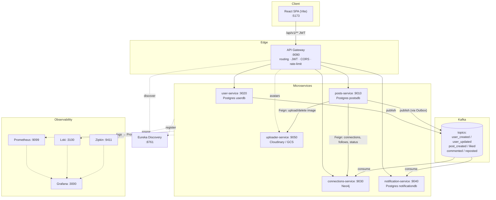
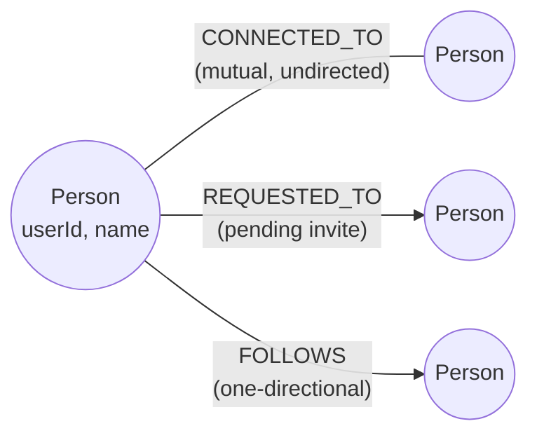
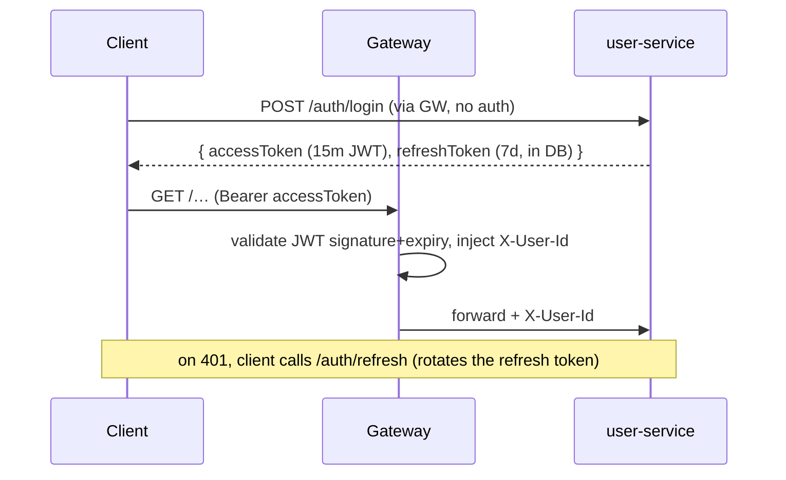
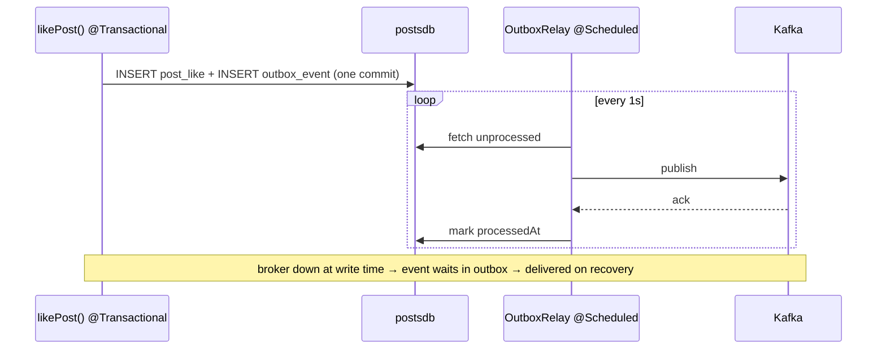

# LinkedIn Clone — Technical Documentation

A professional-network application (feed, connections, messaging, notifications)
built as a **Spring Cloud microservices** system with a **React + TypeScript**
front end. This document describes the architecture, services, data model,
communication, cross-cutting concerns, and the design patterns used.

> Companion docs: [`README-local-dev.md`](README-local-dev.md) (run it locally) ·
> [`FEATURE-TEST-GUIDE.md`](FEATURE-TEST-GUIDE.md) (test every feature).

---

## 1. Overview

| | |
|---|---|
| **Style** | Library-based Spring Cloud microservices (not a service mesh) |
| **Decomposition** | By business capability; **database-per-service** |
| **Sync comms** | Spring Cloud OpenFeign (REST) |
| **Async comms** | Apache Kafka (event choreography) |
| **Persistence** | Postgres (users, posts, notifications) + Neo4j (social graph) |
| **Edge** | Spring Cloud Gateway (routing, JWT auth, CORS, rate limiting) |
| **Discovery** | Netflix Eureka + client-side load balancing |
| **Resilience** | Resilience4j circuit breakers on Feign |
| **Observability** | Micrometer → Prometheus (metrics), Zipkin (traces), Loki/Promtail (logs), Grafana |
| **Front end** | React 19 + Vite + TypeScript + TanStack Query |

---

## 2. System architecture



---

## 3. Services

| Service | Port | Context path | Store | Responsibility |
|---|---|---|---|---|
| **DiscoverServer** | 8761 | — | — | Eureka service registry |
| **APIGateway** | 9090 | — | — | Single entry: routing, JWT validation (injects `X-User-Id`), CORS, sliding-window rate limit on `/auth` |
| **user-service** | 9020 | `/users` | Postgres `userdb` | Auth (signup/login/refresh/logout), profiles, experience/education/skills/endorsements, search, profile-views, messaging, blocking |
| **posts-service** | 9010 | `/posts` | Postgres `postsdb` | Posts, feed, drafts, likes, comments, saves, reposts, hashtags, trending; **saga** + **outbox** |
| **connections-service** | 9030 | `/connections` | Neo4j | Social graph: connections, requests, follows, suggestions, status |
| **notification-service** | 9040 | `/notifications` | Postgres `notificationdb` | Consumes post events → notifications; read-state; per-type preferences |
| **uploader-service** | 9050 | `/uploads` | Cloudinary (GCS impl available) | Image upload + delete |

> Each business service runs a `HandlerInterceptor` that reads the gateway-injected
> `X-User-Id` header into a `ThreadLocal` (`AuthContextHolder`), so controllers/
> services get the caller's id without re-parsing the JWT.

---

## 4. Data model

### 4.1 Relational (Postgres, database-per-service)

**userdb**

| Table | Notes |
|---|---|
| `users` | name, email (unique), bcrypt password, headline, about, avatarUrl, location, currentCompany |
| `experiences`, `educations` | profile sections (owned by userId) |
| `skills`, `endorsements` | skill per user (unique), endorsements per skill (unique per endorser) |
| `refresh_tokens` | opaque, revocable, rotated on use |
| `profile_views` | one row per (viewer, profile), updated in place |
| `messages` | sender/recipient, content, read flag |
| `blocks` | blocker → blocked (unique) |

**postsdb**

| Table | Notes |
|---|---|
| `post` | content, imageUrl, userId, visibility (PUBLIC/CONNECTIONS), status (PUBLISHED/DRAFT), originalPostId (repost), timestamps |
| `post_likes`, `comments`, `comment_likes`, `saved_posts` | engagement; keyed by ids, **no FKs** (so deletes are explicit) |
| `post_hashtags`, `followed_hashtags` | extracted tags; per-user tag follows |
| `outbox_events` | pending domain events (transactional outbox) |

**notificationdb**: `notification` (userId, message, type, targetId, read), `notification_preferences` (per-type mute).

### 4.2 Graph (Neo4j — connections-service)



`Person` nodes are kept in sync from `user_created` / `user_updated` Kafka events.
Suggestions are a 2-hop `CONNECTED_TO` traversal ranked by shared-connection count.

---

## 5. Communication

### 5.1 Synchronous — OpenFeign
- `posts-service → connections-service`: first-degree connections (feed fan-out), following ids, connection status (visibility checks).
- `posts-service → uploader-service`: upload image, delete image (saga compensation).
- All Feign calls go through **gateway wrappers** with **Resilience4j circuit breakers** and fallbacks (empty list for reads, clear error for uploads).

### 5.2 Asynchronous — Kafka (choreography)

| Topic | Producer | Consumer | Effect |
|---|---|---|---|
| `user_created_topic` | user-service | connections-service | create `Person` node |
| `user_updated_topic` | user-service | connections-service | update `Person` name |
| `post_created_topic` | posts-service (outbox) | notification-service | "connection posted" |
| `post_liked_topic` | posts-service (outbox) | notification-service | "liked your post" |
| `post_commented_topic` | posts-service (outbox) | notification-service | "commented on your post" |
| `post_reposted_topic` | posts-service (outbox) | notification-service | "reshared your post" |

Serialization: `JsonSerializer`/`JsonDeserializer` with type headers; consumers trust
`com.codingshuttle.linkedInProject.*`. Every service declares the topics it consumes
**and** produces (a consumer subscribing to a missing topic would auto-create it with
1 partition and keep a stale assignment).

---

## 6. Security



- **Access token**: short-lived (15 min) JWT, HMAC-signed with a shared secret
  (`JWT_SECRET_KEY`), validated **at the gateway** — services never re-validate.
- **Refresh token**: opaque, stored in `refresh_tokens`, **revocable** and
  **rotated** on every refresh; changing your password revokes all of them.
- **Passwords**: bcrypt. **Rate limiting**: sliding window per client IP on `/auth/**`.
- **Authorization**: e.g. connection lists are locked to the caller's own id;
  drafts/connections-only posts return 404 to non-owners (no existence leak).

---

## 7. Design patterns

### 7.1 Saga (orchestrated) — post creation
Three steps that cannot share one transaction. On failure, completed steps are
compensated in reverse.

```mermaid
sequenceDiagram
    participant SAGA as PostCreationSaga
    participant UP as uploader
    participant DB as postsdb
    participant K as Kafka(outbox)
    SAGA->>UP: 1. upload image  (compensation: delete image)
    SAGA->>DB: 2. persist post   (own committed tx; comp: delete post)
    SAGA->>K: 3. publish events
    Note over SAGA: any step fails → run compensations LIFO → SagaFailedException
```
Key point: step 2 **commits independently** (separate `@Transactional` bean), so a
step-3 failure requires an explicit **compensating delete**, not a rollback.

### 7.2 Transactional Outbox — reliable events
The event is written to `outbox_events` **in the same transaction** as the business
change; a scheduled relay publishes it and marks it processed only after the broker acks.



### 7.3 Other patterns
- **Circuit Breaker** (Resilience4j) — Feign calls fail fast + fall back when a
  downstream is down/slow; state exposed via `/actuator/health`.
- **API Composition** — the feed aggregates posts-service data + a Feign call to
  connections-service.
- **Database-per-service** + **polyglot persistence** (Postgres + Neo4j).
- **Batched reads** — feed/comments load per-item aggregates (likes, counts,
  hashtags) in a fixed number of grouped queries instead of N+1.

---

## 8. Observability

- **Metrics**: Actuator + Micrometer Prometheus registry on every service
  (`/{context}/actuator/prometheus`), scraped by Prometheus.
- **Tracing**: Micrometer Tracing (Brave) → Zipkin; context propagates across the
  gateway and Feign hops (via `feign-micrometer`).
- **Logs**: each service writes `logs/<app>.log` with `[service,traceId,spanId]`;
  Promtail ships to Loki; Grafana turns a log line's trace id into a Zipkin link.
- The three signals are correlated by **trace id**.

---

## 9. Technology stack

| Layer | Tech |
|---|---|
| Language / runtime | Java 21 |
| Framework | Spring Boot 3.3–3.4, Spring Cloud 2023.0/2024.0 |
| Web / data | Spring MVC, Spring Data JPA, Spring Data Neo4j |
| Messaging | Spring Kafka |
| Resilience | Resilience4j (Spring Cloud CircuitBreaker) |
| Discovery / gateway | Eureka, Spring Cloud Gateway, OpenFeign, Spring Cloud LoadBalancer |
| Auth | JWT (jjwt), BCrypt |
| Observability | Micrometer, Prometheus, Micrometer Tracing + Zipkin/Brave, Loki, Promtail, Grafana |
| Datastores | PostgreSQL, Neo4j 5, Apache Kafka (KRaft) |
| Object storage | Cloudinary (Google Cloud Storage impl available) |
| Build / deploy | Maven, Jib, Docker Compose, Kubernetes manifests |
| Front end | React 19, Vite, TypeScript, TanStack Query v5, Axios, React Router, Tailwind |

---

## 10. Repository layout

```
linkedInProject/
├── DiscoverServer/          # Eureka
├── APIGateway/              # edge: routing, JWT filter, rate limiter
├── userService/             # auth, profiles, messaging, blocking
├── postsService/            # posts, feed, engagement, saga, outbox
├── ConnectionsService/      # Neo4j graph
├── notification-service/    # Kafka consumer → notifications
├── uploader-service/        # Cloudinary/GCS
├── k8s/                     # Kubernetes manifests
├── docker/                  # prometheus, grafana, promtail configs
├── docker-compose.yml       # Neo4j, Kafka, Zipkin, Prometheus, Loki, Promtail, Grafana
├── logs/                    # per-service log files (shipped to Loki)
├── README-local-dev.md      # run it locally
├── FEATURE-TEST-GUIDE.md    # test every feature
└── DOCUMENTATION.md         # this file
Live Projects/linkedInProject FD/   # React front end (sibling folder)
```

Each service uses layered packages: `controller` → `service` → `repository` →
`entity`, with `dto`, `client` (Feign), `event`, `config`, `exception`, and `auth`.

---

## 11. Configuration & profiles

- **default / local** — host-based dev (services on 902x/901x, infra via Docker Compose).
- **`local` profile** (gitignored `application-local.*`) — real credentials
  (DB, Cloudinary, GCP). Required by the three JPA services and uploader.
- **`k8s` profile** — in-cluster ports/hosts, actuator exposure.
- Key env overrides: `DB_*`, `JWT_SECRET_KEY`, `ZIPKIN_ENDPOINT`,
  `RATELIMIT_REQUESTS`/`_WINDOW_SECONDS`, `LOG_DIR`.

---

## 12. Known limitations & future work

- **Secrets** in `uploader-service` were committed to git history — **must be
  rotated** (Cloudinary secret, GCP key). Code side is already externalized.
- **Scaling**: feed is fan-out-on-read; user search uses a leading-wildcard
  `LIKE` (full scan); the gateway rate limiter is in-memory per instance. Next
  steps: Redis (cache + distributed limiter), Postgres trigram search,
  fan-out-on-write feed.
- **Schema**: `ddl-auto=update` — production would use Flyway/Liquibase.
- **Testing**: minimal automated tests — the highest-value addition (JUnit +
  Mockito + Testcontainers).
- **Outbox relay** assumes a single posts-service instance; multi-instance would
  need `SELECT … FOR UPDATE SKIP LOCKED`.
- **Infra** is single-node (one Kafka broker RF=1, one Neo4j, one Postgres).
